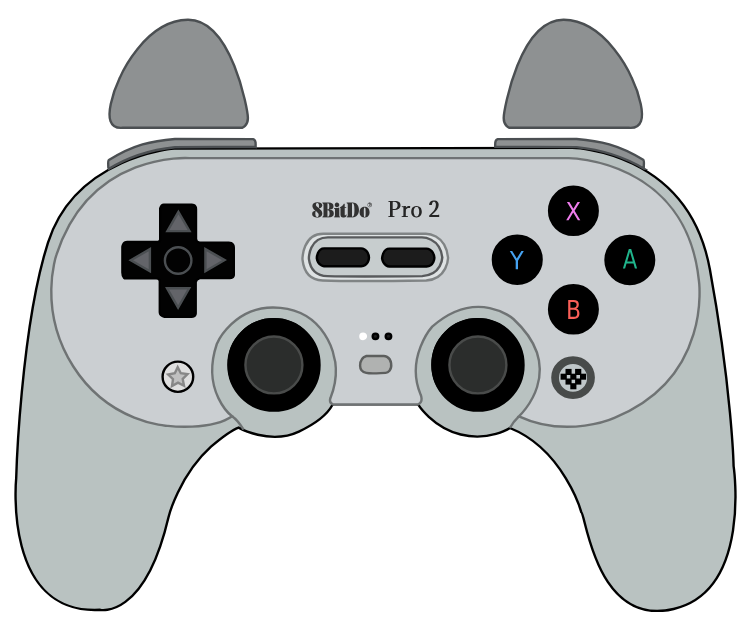

# GamePad Viewer Skin: 8BitDo Pro 2 with Xbox layout

Simple layout to use.
- 8BitDo branding
- gray texture below the sticks
- Xbox face buttons layout

## Usage
Browser Source URL: https://gamepadviewer.com/?p=1&css=https://05jackgb.github.io/GPV-8bitdo-pro2_XboxLayout/8bitdopro2.css

Alternatively, visit [GamePad Viewer](https://gamepadviewer.com/#generate) and generate your own customised URL; be sure to provide the necessary [Custom CSS URL](https://05jackgb.github.io/GPV-8bitdo-pro2_XboxLayout/8bitdopro2.css).

## Usage in OBS
1. If you're using OBS on Linux, be sure to use OBS-studio-browser in order that "Browser" appears in sources.
2. Copy and paste this URL: https://gamepadviewer.com/?p=1&css=https://05jackgb.github.io/GPV-8bitdo-pro2_XboxLayout/8bitdopro2.css
3. Adjust:
    Width: 725
    Height: 586
4. Done.

## Acknowledgements
This project uses [JotaGo's](https://gist.github.com/JotaGo/84e9c728a259d4b40e9fe969ae1aec00) images.

Code is based on [DavidF-Dev's](https://github.com/DavidF-Dev/GPV-8bitdo-pro2-skin/) work.

Original 8BitDo Pro 2 controller: https://www.8bitdo.com/pro2/

GamePad Viewer site: https://www.gamepadviewer.com/
