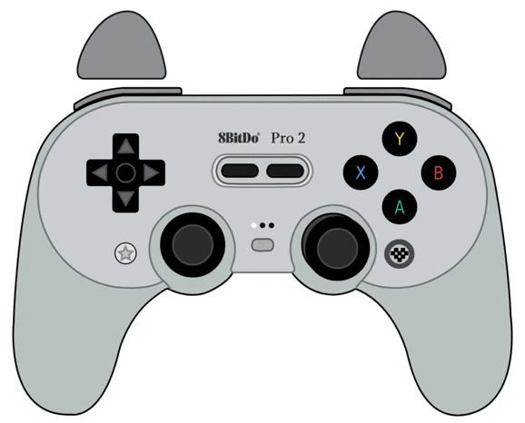

# GamePad Viewer skin: 8BitDo Pro 2 + Xbox ABXY

Simple layout to use.
- Xbox ABXY layout
- 8BitDo branding
- joystick base areas
- redesigned triggers
- independent SVG to ease modifications and compatibilty with GamePad Viewer and OBS

### Browser Source URL to use
- Xbox ABXY face-buttons: [https://gamepadviewer.com/?p=1&css=https://05jackgb.github.io/GPV-8bitdo-pro2_XboxLayout/8bitdopro2.css](https://gamepadviewer.com/?p=1&css=https://05jackgb.github.io/GPV-8bitdo-pro2_XboxLayout/8bitdopro2.css)
- 8BitDo original with PAL SNES colors: [https://gamepadviewer.com/?p=1&css=https://05jackgb.github.io/GPV-8bitdo-pro2_XboxLayout/8bitdopro2-snes.css](https://gamepadviewer.com/?p=1&css=https://05jackgb.github.io/GPV-8bitdo-pro2_XboxLayout/8bitdopro2-snes.css)

Alternatively, visit [GamePad Viewer](https://gamepadviewer.com/#generate) and generate your own customized URL; be sure to copy and paste one of the desired Custom CSS URL below.  

[Custom CSS URL with Xbox ABXY](https://05jackgb.github.io/GPV-8bitdo-pro2_XboxLayout/8bitdopro2.css)  -  [Custom CSS URL with original layout](https://05jackgb.github.io/GPV-8bitdo-pro2_XboxLayout/8bitdopro2-snes.css).

## Usage in OBS
1. If you're on Linux, be sure to use OBS-studio-browser in order that "Browser" appears in sources.
2. Add a "Browser" source.
3. Copy and paste one of the URLs above.
4. Adjustments. Width: 725 and Height: 586
5. Done.
 

### How it was made
- SVG files edited with Inkscape
- Positioning adjusted visually with Beta GamePad Viewer, and then converted to CSS.

Basically: Inkscape → SVG → Beta GPV to mount → CSS → GitHub Pages → GamePad Viewer → OBS.
  

### Acknowledgements
This project uses [Jota-Go's](https://gist.github.com/JotaGo/84e9c728a259d4b40e9fe969ae1aec00) SVGs.

Code is based on [DavidF-Dev's](https://github.com/DavidF-Dev/GPV-8bitdo-pro2-skin/) work.

Original 8BitDo Pro controllers:
- Pro 2: [https://www.8bitdo.com/pro2/](https://www.8bitdo.com/pro2/)
- Pro 3: [https://www.8bitdo.com/pro3/](https://www.8bitdo.com/pro3/)

GamePad Viewer site: [https://www.gamepadviewer.com/](https://www.gamepadviewer.com/)
  
